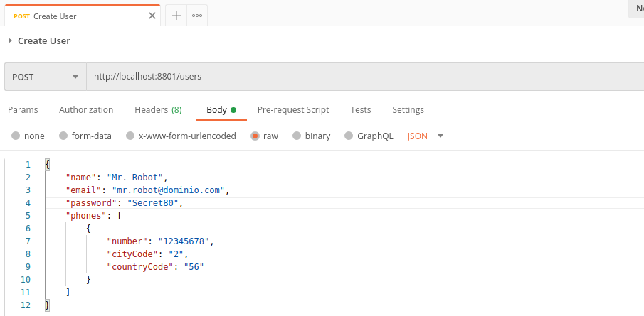
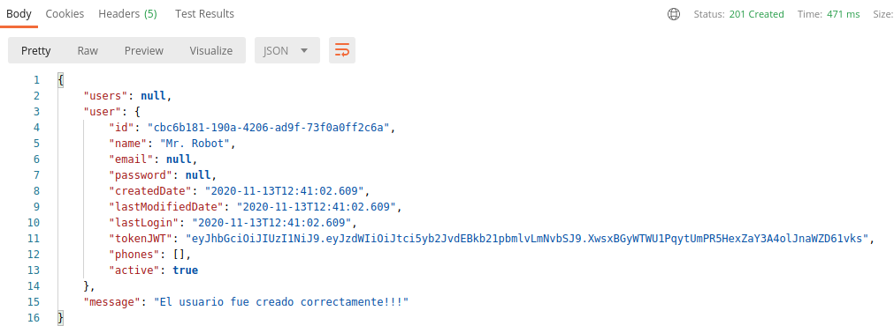
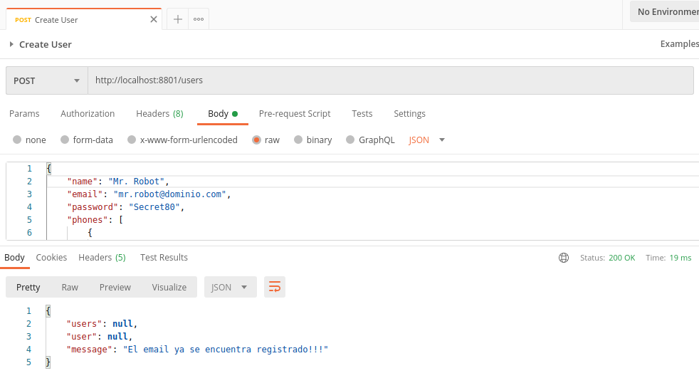
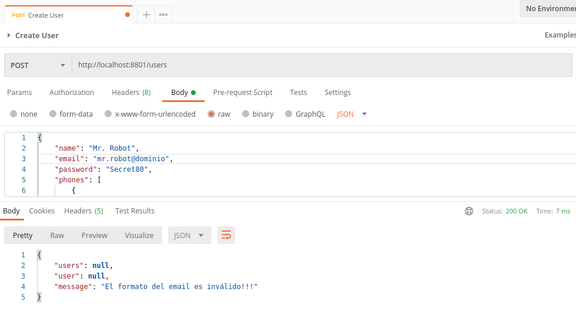
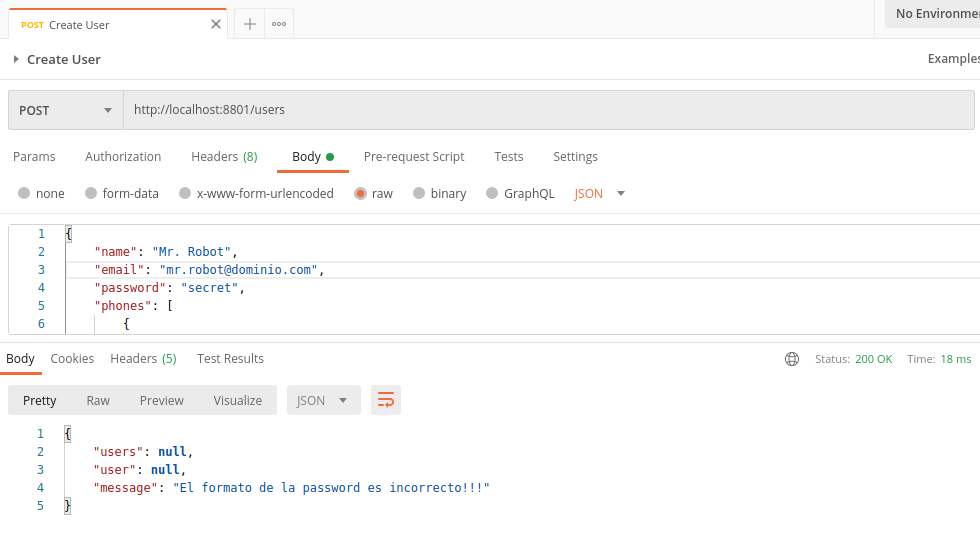
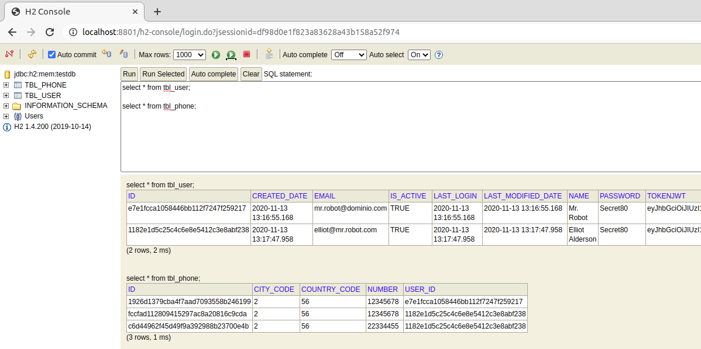

API REST PARA CREACION DE USUARIOS
-----------------------------------------------------------------------------------

API desarrollada con Java 8, Spring Boot, Gradle, JPA y JWT.

La aplicación utiliza una base de datos en memoria (H2) para almacenar usuarios.

-----------------------------------------------------------------------------------

**Diagrama de la solución implementada**


-----------------------------------------------------------------------------------

**Dependencias utilizadas en archivo build.gradle**

```
	implementation 'org.springframework.boot:spring-boot-starter-data-jpa'
	implementation 'org.springframework.boot:spring-boot-starter-web'
	
	implementation 'io.jsonwebtoken:jjwt-api:0.11.2'
    implementation 'io.jsonwebtoken:jjwt-impl:0.11.2'
    implementation 'io.jsonwebtoken:jjwt-gson:0.11.2'
    	
	runtimeOnly 'com.h2database:h2'
```

**Se configura base de datos H2 y se habilita consola de H2 en archivo application.properties**

```
    spring.datasource.url=jdbc:h2:mem:testdb
    spring.datasource.driverClassName=org.h2.Driver
    spring.datasource.username=sa
    spring.datasource.password=password
    spring.jpa.database-platform=org.hibernate.dialect.H2Dialect

    spring.h2.console.enabled=true
    spring.h2.console.path=/h2-console
    spring.h2.console.settings.trace=false

```

-----------------------------------------------------------------------------------

**Se gatilla endpoint para creacion de un usuario desde Postman**

Se envia un HTTP POST a la API REST que se levanta en el puerto 8801:



Cuando la creación del usuario es exitosa se arroja mensaje indicando esto junto 
con una respuesta HTTP 201. Además el retorno muestra el id del usuario en
formato UUID y el token con formato JWT:



-----------------------------------------------------------------------------------

**Validaciones en la creación del usuario**

Se valida si ya existe un usuario creado previamente con una misma dirección de correo:



Se valida si la dirección de correo es válida:



Se valida si el formato de la password es correcto (Una
Mayuscula, letras minúsculas, y dos numeros):



-----------------------------------------------------------------------------------

**Querys en H2 Console**



-----------------------------------------------------------------------------------