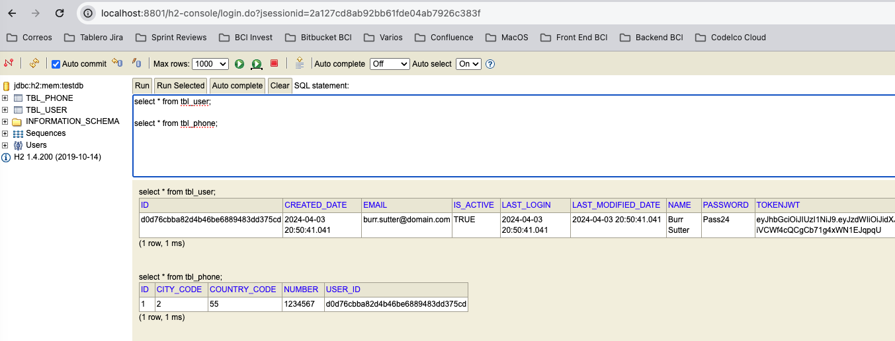

API REST PARA CREACION DE USUARIOS
-----------------------------------------------------------------------------------

API desarrollada con **Java 8, Spring Boot, Gradle, JPA y JWT**.

La aplicación utiliza una base de datos en memoria (H2) para almacenar usuarios.

Se agrega dependencia **Swagger** para generar documentación de forma automática.

Se agrega librería **Lombok** para facilitar manejo de getters, setters y constructors.

Se agrega librería **ModelMapper** para facilitar el mapeo de instancias model a DTO y
viceversa.

-----------------------------------------------------------------------------------

**Diagrama de la solución implementada**


-----------------------------------------------------------------------------------

**Documentación de la API generada con Swagger**


-----------------------------------------------------------------------------------

**Dependencias utilizadas en archivo build.gradle**

```
  implementation 'org.springframework.boot:spring-boot-starter-data-jpa'
  implementation 'org.springframework.boot:spring-boot-starter-web'
	
  implementation 'io.jsonwebtoken:jjwt-api:0.11.2'
  implementation 'io.jsonwebtoken:jjwt-impl:0.11.2'
  implementation 'io.jsonwebtoken:jjwt-gson:0.11.2'
    	
  implementation 'io.springfox:springfox-boot-starter:3.0.0'

  implementation 'org.modelmapper:modelmapper:2.1.1'

  compileOnly 'org.projectlombok:lombok:1.18.20'
  annotationProcessor 'org.projectlombok:lombok:1.18.20'
    	
  runtimeOnly 'com.h2database:h2'
```

**Se configura base de datos H2 y se habilita consola de H2 en archivo application.properties**

```
  spring.datasource.url=jdbc:h2:mem:testdb
  spring.datasource.driverClassName=org.h2.Driver
  spring.datasource.username=sa
  spring.datasource.password=password
  spring.jpa.database-platform=org.hibernate.dialect.H2Dialect

  spring.h2.console.enabled=true
  spring.h2.console.path=/h2-console
  spring.h2.console.settings.trace=false
```

-----------------------------------------------------------------------------------

**Endpoint para creación de un nuevo usuario**

Se envía un HTTP POST a la API REST que se levanta en el puerto 8801.

Cuando la creación del usuario es exitosa se arroja mensaje indicando esto junto 
con una respuesta HTTP 201. Además el retorno muestra el id del usuario en
formato UUID y el token con formato JWT:


-----------------------------------------------------------------------------------

**Querys en H2 Console**



-----------------------------------------------------------------------------------

**Endpoint para listar usuarios**

Se envía una petición HTTP GET al endpoint de usuarios:


-----------------------------------------------------------------------------------

**Endpoint para recuperar un usuario en particular**

Se envía una petición HTTP GET al endpoint de usuarios, enviando el id del usuario en la URL:


-----------------------------------------------------------------------------------

**Endpoint para actualizar los datos de un usuario**

Se envía una petición HTTP PUT al endpoint de usuarios, enviando el id del usuario en la URL:


-----------------------------------------------------------------------------------

**Endpoint para eliminar un usuario**

Se envía una petición HTTP DELETE al endpoint de usuarios, enviando el id del usuario en la URL:


-----------------------------------------------------------------------------------